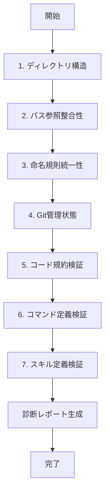

リポジトリ全体の健全性を診断し、潜在的な問題を検出します。

## 使い方

```
/diagnosis
```

## 診断項目

### 1. ディレクトリ構造の検証

プロジェクトの基本構造が正しく配置されているかチェックします。

**チェック内容:**
- `.claude/` ディレクトリの存在確認
- `rules/coding/` ディレクトリの存在確認（タイポチェック含む）
- 必須設定ファイルの存在確認（`.claude/CLAUDE.md`）
- スキル・コマンドディレクトリの整合性

### 2. パス参照の整合性チェック

プロジェクト内のファイルパス参照が壊れていないかチェックします。

**チェック内容:**
- `.claude/CLAUDE.md` 内のパス参照
- スキルファイル内のパス参照
- コマンドファイル内のパス参照
- 相対パスと絶対パスの混在チェック

### 3. 命名規則の統一性チェック

ファイル・ディレクトリ名の表記ゆれをチェックします。

**チェック内容:**
- ディレクトリ名のタイポ（例: `coding` vs `cording`）
- ファイル名の命名規則（kebab-case, PascalCase 等）
- 不適切な文字の使用（スペース、全角文字等）

### 4. Git 管理状態の確認

Git リポジトリの状態をチェックします。

**チェック内容:**
- 未追跡ファイルの検出
- ステージングエリアの確認
- コミットされていない変更の検出
- `.gitignore` の妥当性チェック

### 5. コード規約ファイルの検証

コーディング規約ファイルが正しく配置されているかチェックします。

**チェック内容:**
- `rules/coding/*.md` の存在確認
- 規約ファイルの内容妥当性チェック
- 重複・欠落している規約の検出

### 6. コマンド定義の整合性チェック

`.claude/commands/` 内のコマンド定義が正しいかチェックします。

**チェック内容:**
- コマンドファイルの形式チェック
- 必須セクションの存在確認（使い方、手順等）
- コマンド間の依存関係チェック
- 重複コマンドの検出

### 7. スキル定義の整合性チェック

`.claude/skills/` 内のスキル定義が正しいかチェックします。

**チェック内容:**
- スキルファイルの形式チェック（front matter の存在）
- `name`, `description` フィールドの存在確認
- スキル間の重複チェック

## 実行フロー



## 出力フォーマット

```
🏥 リポジトリ診断レポート
═══════════════════════════════
実行日時: YYYY-MM-DD HH:MM:SS
リポジトリ: <リポジトリ名>

━━━━━━━━━━━━━━━━━━━━━━━━━━━━━
📁 1. ディレクトリ構造
━━━━━━━━━━━━━━━━━━━━━━━━━━━━━

✅ `.claude/` ディレクトリ: 存在
✅ `.claude/CLAUDE.md`: 存在
⚠️  `rules/coding/`: 存在しません → `rules/cording/` が検出されました（タイポの可能性）

━━━━━━━━━━━━━━━━━━━━━━━━━━━━━
🔗 2. パス参照の整合性
━━━━━━━━━━━━━━━━━━━━━━━━━━━━━

❌ 壊れた参照を検出:
   - .claude/CLAUDE.md:30 → `rules/coding/react.md` (ファイルが存在しません)
   - .claude/skills/fix/SKILL.md:32 → `.claude/rules/coding/` (ディレクトリが存在しません)

━━━━━━━━━━━━━━━━━━━━━━━━━━━━━
📝 3. 命名規則の統一性
━━━━━━━━━━━━━━━━━━━━━━━━━━━━━

⚠️  タイポの可能性:
   - `rules/cording/` → `rules/coding/` が正しい可能性があります

━━━━━━━━━━━━━━━━━━━━━━━━━━━━━
🗂️  4. Git 管理状態
━━━━━━━━━━━━━━━━━━━━━━━━━━━━━

⚠️  未追跡ファイル: 2件
   - .claude/rules/cording/
   - .claude/skills/fix/

📝 ステージングエリア: 0件
📝 変更未コミット: 5件

━━━━━━━━━━━━━━━━━━━━━━━━━━━━━
📋 5. コード規約ファイル
━━━━━━━━━━━━━━━━━━━━━━━━━━━━━

❌ 規約ファイルが見つかりません:
   期待: `rules/coding/*.md`
   実際: `rules/cording/*.md` が検出されました

━━━━━━━━━━━━━━━━━━━━━━━━━━━━━
⚙️  6. コマンド定義
━━━━━━━━━━━━━━━━━━━━━━━━━━━━━

✅ コマンド数: 11件
✅ 形式エラー: なし

━━━━━━━━━━━━━━━━━━━━━━━━━━━━━
🎯 7. スキル定義
━━━━━━━━━━━━━━━━━━━━━━━━━━━━━

✅ スキル数: 3件
✅ 形式エラー: なし

━━━━━━━━━━━━━━━━━━━━━━━━━━━━━
📊 診断サマリー
━━━━━━━━━━━━━━━━━━━━━━━━━━━━━

| カテゴリ | 状態 | 問題数 |
|---------|------|--------|
| ディレクトリ構造 | ⚠️ Warning | 1件 |
| パス参照整合性 | ❌ Error | 2件 |
| 命名規則統一性 | ⚠️ Warning | 1件 |
| Git管理状態 | ⚠️ Warning | 7件 |
| コード規約 | ❌ Error | 1件 |
| コマンド定義 | ✅ OK | 0件 |
| スキル定義 | ✅ OK | 0件 |

─────────────────────────
総合判定
─────────────────────────

❌ **要修正** (Error: 3件, Warning: 9件)

─────────────────────────
推奨アクション
─────────────────────────

優先度 高:
1. ディレクトリ名のタイポを修正: `rules/cording/` → `rules/coding/`
2. パス参照を修復（上記修正で自動的に解決）

優先度 中:
3. 未追跡ファイルを Git に追加
4. 変更をコミット

実行コマンド例:
\`\`\`bash
# タイポ修正
mv rules/cording rules/coding

# Git管理
git add .claude/rules/coding/
git commit -m "fix: ディレクトリ名のタイポを修正 (cording → coding)"
\`\`\`
```

## エラーレベル

| レベル | 意味 | 対応 |
|--------|------|------|
| ✅ OK | 問題なし | アクション不要 |
| 🔵 Info | 参考情報 | 任意で対応 |
| ⚠️ Warning | 軽微な問題 | 修正推奨 |
| ❌ Error | 致命的な問題 | 即座に修正必須 |

## 注意事項

- このコマンドは読み取り専用で、ファイルを変更しません
- 検出された問題の修正は手動またはユーザーの承認後に実行します
- 診断結果はあくまで推奨であり、プロジェクトの特性に応じて判断してください
