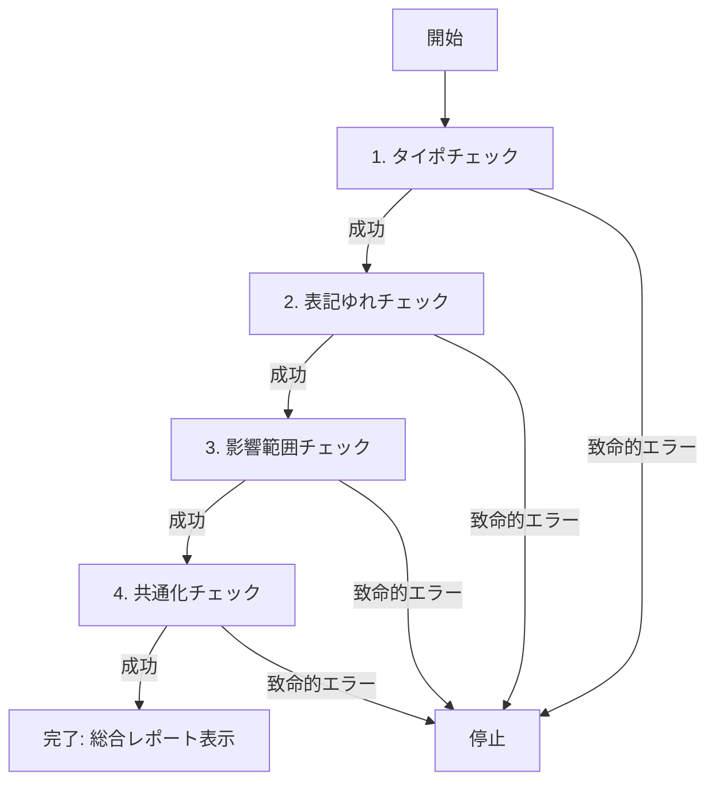

変更差分の総合チェックを実行します。typo → consistency → diff-impact → commonize の順に実行し、エラーが発生した場合はそこで停止します。

## 使い方

```
/check:review [ベースブランチ]
```

- ベースブランチは `diff-impact` チェックに渡されます
- ベースブランチ省略時は自動検出されます

## 手順

### 1. タイポチェック (`/check:typo`)

変更差分に含まれるタイポ・不要な文字変更をチェックします。

**実行内容:**
- スペルミスの検出
- 全角/半角混在の検出
- 不要な空白・改行の検出

**エラー時の動作:**
- タイポが検出された場合でも警告として表示し、次のステップに進む
- Git コマンドエラーなど致命的なエラーの場合は停止

### 2. 表記ゆれチェック (`/check:consistency`)

変更差分に含まれる表記ゆれをチェックします。

**実行内容:**
- 日本語表記ゆれの検出（ユーザー vs ユーザ など）
- 英語表記ゆれの検出（color vs colour など）
- プロジェクト全体での使用状況の分析

**エラー時の動作:**
- 表記ゆれが検出された場合でも警告として表示し、次のステップに進む
- Git コマンドエラーなど致命的なエラーの場合は停止

### 3. 影響範囲チェック (`/check:diff-impact`)

変更差分が影響するURLを特定します。

**実行内容:**
- Next.js ルーティングの分析
- コンポーネント使用箇所の特定
- 影響を受けるURLのリスト化

**エラー時の動作:**
- Git コマンドエラーなど致命的なエラーの場合は停止

### 4. 共通化チェック (`/check:commonize`)

変更差分に含まれる共通化できそうなコードを検出します。

**実行内容:**
- 重複・類似コードブロックの検出
- 共通化候補の優先度分類（高・中・低）
- 共通化方法の提案（ユーティリティ関数・カスタムフック・共通コンポーネントなど）

**エラー時の動作:**
- Git コマンドエラーなど致命的なエラーの場合は停止

## 実行フロー



## 出力フォーマット

各チェックの結果を順番に表示し、最後に総合サマリーを出力します。

```
🔍 変更差分の総合チェック
═══════════════════════════════

━━━━━━━━━━━━━━━━━━━━━━━━━━━━━
1️⃣ タイポチェック
━━━━━━━━━━━━━━━━━━━━━━━━━━━━━

[/check:typo の出力]

━━━━━━━━━━━━━━━━━━━━━━━━━━━━━
2️⃣ 表記ゆれチェック
━━━━━━━━━━━━━━━━━━━━━━━━━━━━━

[/check:consistency の出力]

━━━━━━━━━━━━━━━━━━━━━━━━━━━━━
3️⃣ 影響範囲チェック
━━━━━━━━━━━━━━━━━━━━━━━━━━━━━

[/check:diff-impact の出力]

━━━━━━━━━━━━━━━━━━━━━━━━━━━━━
4️⃣ 共通化チェック
━━━━━━━━━━━━━━━━━━━━━━━━━━━━━

[/check:commonize の出力]

━━━━━━━━━━━━━━━━━━━━━━━━━━━━━
📊 総合レポート
━━━━━━━━━━━━━━━━━━━━━━━━━━━━━

## チェック結果

✅ タイポチェック: 完了
   - タイポ: 2件
   - 不要な変更: 5箇所

✅ 表記ゆれチェック: 完了
   - 表記ゆれ: 2件
   - 修正推奨: 3箇所

✅ 影響範囲チェック: 完了
   - 影響URL: 4件
   - 変更ファイル: 8件
   - グローバル影響: あり

✅ 共通化チェック: 完了
   - 高優先度: 1件
   - 中優先度: 2件
   - 低優先度: 1件

🔍 対象: <ベース>...<比較> (<コミット数>コミット, <変更ファイル数>ファイル)

─────────────────────────
🔴 Error（修正必須）
─────────────────────────
- [ファイル:行番号] [説明]

─────────────────────────
🟡 Warning（修正推奨）
─────────────────────────
- [ファイル:行番号] [説明]

─────────────────────────
🔵 Info（参考情報）
─────────────────────────
- [ファイル:行番号] [説明]

─────────────────────────
✅ 総合判定: [LGTM / 要修正 / 要確認]
─────────────────────────

## 推奨アクション

1. タイポの修正（2件）
2. 表記ゆれの統一（2件）
3. 影響URLでの動作確認（4件）
4. 共通化の検討（3件）

合計: 12件の確認事項
```

## エラーハンドリング

### 致命的エラー（停止）

以下のエラーが発生した場合は即座に停止:
- Git リポジトリが存在しない
- Git コマンドの実行に失敗
- 必要なファイルへのアクセス権限がない

### 警告（継続）

以下は警告として表示し、次のチェックに進む:
- タイポが検出された
- 表記ゆれが検出された
- 変更差分が存在しない

## 注意事項

- 各チェックは独立して実行されるため、1つのチェックで警告が出ても次のチェックは実行されます
- 致命的なエラーが発生した時点で残りのチェックはスキップされます
- 引数 `[ベースブランチ]` は `diff-impact` チェックにのみ使用されます
- 全てのチェックが正常に完了した後、統合された総合レポートが表示されます
