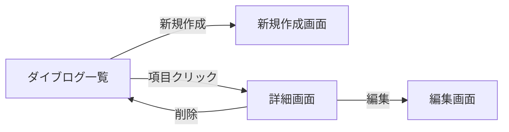

# <画面名>（例: ダイブログ一覧）

> このテンプレートは `docs/specs/screens/<画面名>.md` を新規作成するときの雛形。
> 不要なセクションは削除して構わないが、**メタ情報** と **画面要素** は必ず残す。

## メタ情報

| 項目 | 内容 |
|------|------|
| 画面ID | `dive-log-list`（ファイル名と一致させる） |
| 関連機能 | [002 ダイブログ CRUD](../features/002-dive-log-crud/requirements.md) |
| ルート | `/dives` |
| 認証 | 必須 / 不要 |
| 対応端末 | モバイル / タブレット / PC |
| ステータス | ドラフト / レビュー中 / 確定 / 廃止 |

## 1. 目的・概要

- この画面は誰が、何のために使うのか
- ユーザーが達成したいゴール
- 関連する業務フロー上の位置付け

## 2. 画面構成

### レイアウト

ワイヤーフレーム・モックアップへのリンクや、Mermaid / ASCII で構造を示す。

```
┌─────────────────────────────┐
│ Header                       │
├─────────────────────────────┤
│ ページタイトル + 操作ボタン   │
├─────────────────────────────┤
│ フィルタ / 検索               │
├─────────────────────────────┤
│ リスト本体                    │
│  - アイテム 1                 │
│  - アイテム 2                 │
├─────────────────────────────┤
│ ページネーション              │
└─────────────────────────────┘
```

### 画面要素

| ID | 要素 | 種別 | 表示内容 | 補足 |
|----|------|------|---------|------|
| E1 | ページタイトル | テキスト | `ダイブログ一覧` | h1 |
| E2 | 新規作成ボタン | ボタン | `+ 新規作成` | クリックで `/dives/new` へ |
| E3 | 検索ボックス | input | プレースホルダ `場所で検索` | デバウンス 300ms |
| E4 | リスト | カード | 1 ログ 1 カード | 後述の項目定義参照 |
| E5 | ページネーション | コンポーネント | 1 ページ 20 件 | 0 件時は非表示 |

### 項目定義（リスト 1 件あたり）

| 項目 | データソース | 表示形式 | 補足 |
|------|------------|---------|------|
| 潜水日 | `dives.dive_date` | `YYYY/MM/DD` | 必須 |
| 場所 | `dives.location` | 文字列 | 必須 |
| 最大水深 | `dives.max_depth_m` | `XX.X m` | 必須 |
| 潜水時間 | `dives.bottom_time_min` | `XX 分` | 必須 |
| バディ | `dives.buddy_name` | 文字列 | 空なら非表示 |

## 3. 状態（State）

| 状態 | 条件 | 表示 |
|------|------|------|
| 初期表示 | 認証済み、データあり | リスト + ページネーション |
| 空 | データ 0 件 | 空状態メッセージ + 新規作成ボタン誘導 |
| ローディング | データ取得中 | スケルトン UI |
| エラー | API エラー | エラーメッセージ + 再試行ボタン |
| 未認証 | セッションなし | `/login` へリダイレクト |

## 4. 操作・遷移

| 操作 | トリガー | 遷移先・挙動 |
|------|---------|-------------|
| 新規作成 | E2 クリック | `/dives/new` へ遷移 |
| 詳細表示 | リスト項目クリック | `/dives/[id]` へ遷移 |
| 検索 | E3 入力 | デバウンス後にリスト再取得 |
| ページ移動 | E5 クリック | URL クエリ `?page=N` を更新して再取得 |

### 画面遷移図



## 5. バリデーション・エラーメッセージ

| 項目 | 条件 | メッセージ |
|------|------|-----------|
| 検索キーワード | 100 文字超 | `100 文字以内で入力してください` |

API エラーの表示パターンは `docs/specs/features/<該当機能>/design.md` を参照。

## 6. アクセシビリティ要件

- 見出し階層: `h1 → h2` の順を守る
- リストは `<ul>` / `<li>` で構造化、項目クリックは `<a>` または `<button>`
- ローディング中は `role="status"` + `aria-live="polite"` を付与
- エラーメッセージは `role="alert"`
- フォーカスインジケーターを 2px 以上で明示
- カラーコントラスト比 4.5:1 以上（WCAG AA）

詳細は `rules/accessibility.md` に準拠。

## 7. レスポンシブ

| ブレークポイント | レイアウト変化 |
|----------------|--------------|
| `< 768px`（モバイル） | 1 カラム、フィルタは折りたたみ |
| `>= 768px`（タブレット以上） | 2 カラム、フィルタは常時表示 |

タッチターゲットは 44×44px 以上。

## 8. 表示条件・権限

- 認証済みユーザーのみ閲覧可能
- 表示されるログは `dives.user_id = auth.uid()` のもののみ（RLS で保証）

## 9. 関連リソース

- 要件: [`specs/features/002-dive-log-crud/requirements.md`](../features/002-dive-log-crud/requirements.md)
- 設計: [`specs/features/002-dive-log-crud/design.md`](../features/002-dive-log-crud/design.md)
- 実装: `service-front/src/app/(app)/dives/page.tsx`
- 関連画面: [`dive-log-detail.md`](dive-log-detail.md) / [`dive-log-new.md`](dive-log-new.md)

## 10. 変更履歴

| 日付 | 変更内容 | 担当 |
|------|---------|------|
| YYYY-MM-DD | 初版作成 | - |
