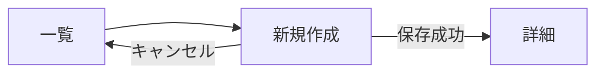

# ダイブログ新規作成

## メタ情報

| 項目 | 内容 |
|------|------|
| 画面ID | `dive-new` |
| 関連機能 | [002 ダイブログ CRUD](../features/002-dive-log-crud/requirements.md) |
| ルート | `/dives/new` |
| 認証 | 必須 |
| 対応端末 | モバイル / タブレット / PC |
| ステータス | ドラフト |

## 1. 目的・概要

ダイブログを新規作成する。必須項目のみで素早く登録できることを優先し、任意項目はセクション折りたたみで初期表示の情報量を抑える。送信成功時は作成された詳細画面にリダイレクトする。

## 2. 画面構成

### レイアウト

```
┌───────────────────────────────────────┐
│ Header                                  │
├───────────────────────────────────────┤
│ ← 一覧に戻る                           │
├───────────────────────────────────────┤
│ h1: ダイブログを追加                   │
├───────────────────────────────────────┤
│ ▼ 基本情報（常時展開）                  │
│   潜水日 * / 場所 *                    │
├───────────────────────────────────────┤
│ ▼ 潜水データ（常時展開）                │
│   最大水深 * / 潜水時間 *              │
├───────────────────────────────────────┤
│ ▼ コンディション（折りたたみ）          │
│ ▼ 装備・ガス（折りたたみ）              │
│ ▼ メンバー（折りたたみ）                │
│ ▼ メモ（折りたたみ）                    │
├───────────────────────────────────────┤
│       [キャンセル]  [保存する]          │
└───────────────────────────────────────┘
```

### 画面要素

| ID | 要素 | 種別 | 表示内容 | 補足 |
|----|------|------|---------|------|
| E1 | 戻るリンク | リンク | `← 一覧に戻る` | `/dives` |
| E2 | ページタイトル | テキスト | `ダイブログを追加` | h1 |
| E3 | フォーム | `DiveForm` | 後述の項目定義 | `react-hook-form` + yup |
| E4 | キャンセルボタン | リンクボタン | `キャンセル` | `/dives` |
| E5 | 保存ボタン | submit ボタン | `保存する` | `disabled`：送信中 / 必須欠落 |
| E6 | エラーサマリー | 領域 | バリデーション失敗時の集約 | `role="alert"`、最上部にスクロール |

### 項目定義（フォーム）

必須項目は **必須 ✓**、`*` は UI 上のマーク。

| セクション | フィールド | 入力種別 | 必須 | バリデーション | プレースホルダ / 補足 |
|----------|----------|---------|:---:|--------------|--------------------|
| 基本情報 | 潜水日 `*` | date | ✓ | 必須 / 未来日不可 | `dives.dive_date` |
| 基本情報 | 場所 `*` | text | ✓ | 必須 / 100 文字以内 | `例: 石垣島・米原` |
| 基本情報 | エントリー時刻 | time |  | `exit_time` より前 | `dives.entry_time` |
| 基本情報 | エキジット時刻 | time |  | `entry_time` より後 | `dives.exit_time` |
| 基本情報 | 国 | text |  | 50 文字以内 | `例: Japan` |
| 基本情報 | ポイント | text |  | 100 文字以内 | `dives.dive_site` |
| 基本情報 | ダイブ形態 | select |  | `constants.diveTypes` | ボート / ビーチ / ドリフト |
| 基本情報 | ダイブ番号 | number |  | 1 以上の整数 | `dives.dive_number` |
| 基本情報 | 講習ダイブ | checkbox |  | - | `dives.certification_dive` |
| コンディション | 天気 | select |  | `constants.weathers` | 晴 / 曇 / 雨 など |
| コンディション | 気温（℃） | number |  | -50〜50、小数 1 桁 | `dives.air_temp_c` |
| コンディション | 水温（℃） | number |  | -2〜40、小数 1 桁 | `dives.water_temp_c` |
| コンディション | 透明度（m） | number |  | 0〜80、小数 1 桁 | `dives.visibility_m` |
| コンディション | 波 | select |  | `constants.waves` | なし / 弱 / 強 |
| コンディション | 流れ | select |  | `constants.currents` | なし / 弱 / 強 |
| 潜水データ | 最大水深（m）`*` | number | ✓ | > 0 / ≤ 200 / 小数 2 桁 | `dives.max_depth_m` |
| 潜水データ | 平均水深（m） | number |  | 0〜`max_depth_m` / 小数 2 桁 | `dives.avg_depth_m` |
| 潜水データ | 潜水時間（分）`*` | number | ✓ | 整数 ≥ 1 / ≤ 600 | `dives.bottom_time_min` |
| 潜水データ | 水面休息（分） | number |  | 整数 ≥ 0 | `dives.surface_interval_min` |
| 装備・ガス | タンク種別 | select |  | スチール / アルミ | `dives.tank_type` |
| 装備・ガス | タンク容量（L） | number |  | 0〜30、小数 1 桁 | `dives.tank_volume_l` |
| 装備・ガス | ガス種別 | select |  | Air / Nitrox | `dives.gas_type` |
| 装備・ガス | 酸素濃度（%） | number |  | 21〜100、ガス種別 = Nitrox のみ表示 | `dives.o2_percent` |
| 装備・ガス | 開始残圧（bar） | number |  | 整数 0〜300 | `dives.pressure_start_bar` |
| 装備・ガス | 終了残圧（bar） | number |  | 整数 0〜`pressure_start_bar` | `dives.pressure_end_bar` |
| 装備・ガス | ウェイト（kg） | number |  | 0〜30、小数 1 桁 | `dives.weight_kg` |
| 装備・ガス | スーツ | text |  | 50 文字以内 | `例: ウェット 5mm` |
| 装備・ガス | 装備メモ | textarea |  | 500 文字以内 | `dives.equipment_notes` |
| メンバー | バディ | text |  | 100 文字以内 | `dives.buddy_name` |
| メンバー | インストラクター | text |  | 100 文字以内 | `dives.instructor_name` |
| メモ | メモ | textarea |  | 2000 文字以内 | `dives.notes` |

## 3. 状態（State）

| 状態 | 条件 | 表示 |
|------|------|------|
| 初期表示 | 認証済み | フォーム（必須セクションのみ展開） |
| 入力中 | フィールドフォーカス | リアルタイムバリデーションは onBlur で実行 |
| バリデーションエラー | 送信時に必須欠落・型違反 | E6 サマリー + 各フィールドにメッセージ |
| 送信中 | E5 押下後 | フォーム全体 `disabled`、E5 にスピナー |
| 送信成功 | Server Action 成功 | `/dives/[新規 id]` へリダイレクト + トースト |
| 送信エラー | Server Action 失敗 | E6 にサーバーエラーを表示、フォームは維持 |
| 未認証 | セッションなし | `/login` へリダイレクト |

## 4. 操作・遷移

| 操作 | トリガー | 遷移先・挙動 |
|------|---------|-------------|
| キャンセル | E1 / E4 クリック | 未入力なら即 `/dives`、入力ありは離脱確認ダイアログ |
| セクション展開 | セクション見出しクリック | `aria-expanded` をトグル |
| 保存 | E5 クリック / Enter | Server Action `createDive(values)` 実行 |

### 画面遷移図



## 5. バリデーション・エラーメッセージ

| 項目 | 条件 | メッセージ |
|------|------|-----------|
| 潜水日 | 未入力 | `潜水日を入力してください` |
| 潜水日 | 未来日 | `未来の日付は選べません` |
| 場所 | 未入力 | `場所を入力してください` |
| 場所 | 101 文字以上 | `100 文字以内で入力してください` |
| 最大水深 | 未入力 / 0 以下 | `最大水深を 1 m 以上で入力してください` |
| 最大水深 | 200 超 | `最大水深は 200 m までです` |
| 平均水深 | 最大水深超 | `平均水深は最大水深以下にしてください` |
| 潜水時間 | 未入力 / 0 以下 | `潜水時間を 1 分以上で入力してください` |
| エキジット時刻 | エントリー時刻以前 | `エキジットはエントリーより後にしてください` |
| 終了残圧 | 開始残圧超 | `終了残圧は開始残圧以下にしてください` |

サーバーエラー（5xx・ネットワーク）は E6 に `しばらく経ってからもう一度お試しください` を表示。

## 6. アクセシビリティ要件

- 各 input に `<label htmlFor>` を明示
- 必須項目は `aria-required="true"` + ラベルに `*`（`aria-label` 含めて伝達）
- エラーは `aria-describedby` で input に紐付け、`role="alert"`
- E6 エラーサマリーは送信失敗時に最初のエラーフィールドへフォーカス移動
- 折りたたみセクションは `<button aria-expanded aria-controls>` + パネル側 `<div role="region">`
- 送信中ボタンは `aria-busy="true"`
- フォームのフォーカス順序は視覚的な順序と一致

詳細は `rules/accessibility.md` に準拠。

## 7. レスポンシブ

| ブレークポイント | レイアウト変化 |
|----------------|--------------|
| `< 768px` | 1 カラム、フィールドは縦並び |
| `>= 768px` | 1 カラム（最大 720px）、関連フィールド（気温/水温など）は 2 列に |

タッチターゲット 44×44px 以上、数値入力は `inputmode="decimal"`。

## 8. 表示条件・権限

- 認証済みユーザーのみアクセス可能
- 保存される `user_id` は `auth.uid()` を Server Action 側で強制セット（クライアント送信値は無視）

## 9. 関連リソース

- 要件: [`specs/features/002-dive-log-crud/requirements.md`](../features/002-dive-log-crud/requirements.md)
- 設計: [`specs/features/002-dive-log-crud/design.md`](../features/002-dive-log-crud/design.md)
- 実装: `service-front/src/app/(app)/dives/new/page.tsx` / `features/dives/components/DiveForm.tsx`
- 関連画面: [`dive-list.md`](dive-list.md) / [`dive-edit.md`](dive-edit.md)

## 10. 変更履歴

| 日付 | 変更内容 | 担当 |
|------|---------|------|
| 2026-05-27 | 初版作成 | - |
