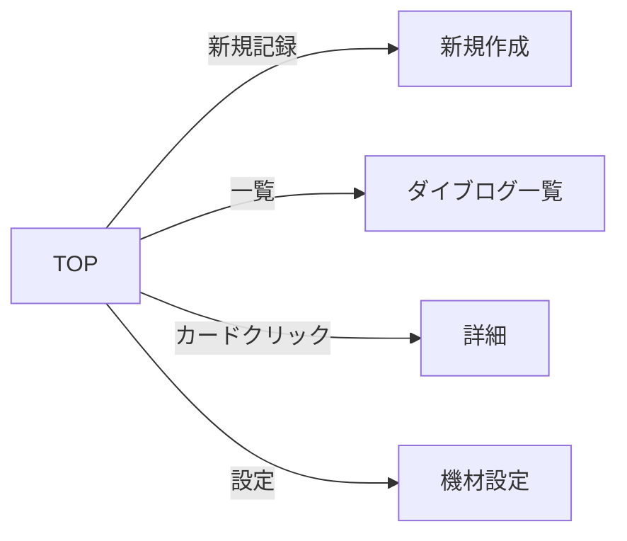

# TOP（ダッシュボード）

> **ステータス: 確定** — 003-dashboard 設計時に主要 TBD は解消済み。詳細は [`../features/003-dashboard/`](../features/003-dashboard/) を参照。

## メタ情報

| 項目 | 内容 |
|------|------|
| 画面ID | `top` |
| 関連機能 | [003 ダッシュボード](../features/003-dashboard/requirements.md) |
| ルート | `/` |
| 認証 | 必須（未認証は `/login` にリダイレクト。`src/proxy.ts` の `APP_ROUTE_PREFIXES` に `/` を追加） |
| 対応端末 | モバイル / タブレット / PC |
| ステータス | 確定（実装未着手） |

## 1. 目的・概要

ログインしたダイバーが「自分のダイビング活動の今」を一目で把握するためのダッシュボード画面。

- 累計ダイブ本数・潜水時間を可視化することで、ダイバーとしての歩みを実感できる
- レギュレーターのオーバーホール期限を可視化することで、安全面のリマインダーになる
- 最近のログへの導線、新規記録への導線を提供することで、日常的な使い方の入口になる

## 2. 画面構成

### レイアウト（モバイル）

```
┌──────────────────────────────────┐
│ Header                            │
├──────────────────────────────────┤
│ こんにちは、🪼〇〇さん              │
│ 前回のダイブから 12 日              │
│              [＋ 新しいログを記録]  │
├──────────────────────────────────┤
│ ┌───────────┐ ┌───────────┐      │
│ │ 累計本数    │ │ 累計時間    │      │
│ │ 42 本      │ │ 31 時間 25 分│      │
│ └───────────┘ └───────────┘      │
│ ┌───────────┐ ┌───────────┐      │
│ │ 最大水深    │ │ 訪問スポット │      │
│ │ 32.5 m     │ │ 18 か所     │      │
│ └───────────┘ └───────────┘      │
├──────────────────────────────────┤
│ ⚠️ レギュレーター OH              │
│ 前回: 2025-08-12                  │
│ 次回推奨: 2026-08-12 / 100 本目   │
│ [余裕 / 期限間近 / 期限切れ ]      │
│                  [設定 →]         │
├──────────────────────────────────┤
│ 最近のダイブログ            [一覧→]│
│  - 2026-05-20  石垣島・米原        │
│  - 2026-05-19  石垣島・崎枝        │
│  - 2026-05-18  ...                 │
└──────────────────────────────────┘
```

### 画面要素

| ID | 要素 | 種別 | 内容 |
|----|------|------|------|
| E1 | ヒーロー | テキスト + ボタン | ユーザー名 / 経過日数 / 「＋ 新しいログを記録」 |
| E2 | 統計カード | カード×4 | 累計本数 / 累計時間 / 最大水深 / 訪問スポット数 |
| E3 | レギュレーターパネル | カード | OH 状況サマリー（後述） |
| E4 | 最近のログ | リスト | 直近 5 件の DiveCard（一覧画面と同コンポーネント） |
| E5 | 一覧へのリンク | リンク | E4 の右上 |
| E6 | （オプション）月別グラフ | チャート | 🟡 TBD: Phase 1 で入れるか後回しか |

## 3. 累計潜水時間機能

### 計算ロジック

| 指標 | 計算式 |
|------|-------|
| 累計ダイブ本数 | `count(*) from dives where user_id = auth.uid()` |
| 累計潜水時間 | `sum(bottom_time_min) from dives where user_id = auth.uid()` |
| 最大水深 | `max(max_depth_m) from dives where user_id = auth.uid()` |
| 訪問スポット数 | `count(distinct location) from dives where user_id = auth.uid()` |

### 表示

- 累計潜水時間: `XX 時間 YY 分`（60 分未満なら `YY 分`、100 時間超なら `XX 時間` まで丸めるかは 🟡 TBD）
- 累計本数: `XX 本`
- 最大水深: `XX.X m`
- 訪問スポット数: `XX か所`

### 取得方針

- Server Component で 1 回の RPC（または 1 クエリ）で集計値をまとめて取得する
- 件数が少ないうちは都度集計で十分。1000 件超を想定するなら **マテリアライズドビュー** や **集計キャッシュテーブル** を検討（🟡 TBD: Phase 1 では都度集計でいくか）

### スキーマへの影響

- 既存 `dives` のみで実装可能。追加のテーブルは不要

## 4. レギュレーターのオーバーホール機能

### コンセプト

PADI / 各メーカー推奨「1 年または 100 ダイブごとに OH」をリマインドする。ユーザーが前回 OH 日と機材情報を登録すると、TOP に「次回推奨日」と「残日数 / 残本数」が表示される。

### データモデル提案

#### 案 A: 1 ユーザー 1 レギュレーター（`user_details` に列追加）

`user_details` テーブルに以下を追加:
- `regulator_name text`
- `regulator_last_overhauled_on date`
- `regulator_overhaul_interval_months int default 12`
- `regulator_overhaul_interval_dives int default 100`

**メリット**: テーブル追加なし、シンプル
**デメリット**: 複数機材（バックアップ・ドライ用など）に対応できない

#### 案 B: 別テーブル `regulators`（複数機材対応）

```sql
create table public.regulators (
    id uuid primary key default gen_random_uuid(),
    user_id uuid not null references public.users(id) on delete cascade,
    brand text,
    model text,
    purchased_on date,
    last_overhauled_on date,
    overhaul_interval_months integer not null default 12 check (overhaul_interval_months > 0),
    overhaul_interval_dives integer not null default 100 check (overhaul_interval_dives > 0),
    is_primary boolean not null default false,
    notes text,
    created_at timestamptz not null default now(),
    updated_at timestamptz not null default now()
);
```

**メリット**: 複数機材対応、将来の拡張に強い
**デメリット**: 1 機材しか持たない人にとってはオーバースペック

🟡 **TBD: 案 A / 案 B どちらで進めるか**
推奨は **案 B**（拡張性 + ダイバーは 2 本目を持つことが普通）。

### 計算ロジック

```
nextOverhaulDate = last_overhauled_on + overhaul_interval_months（カレンダー）
nextOverhaulDive = OH 以降の dive 本数 ≥ overhaul_interval_dives
```

| ステータス | 条件 |
|----------|------|
| **余裕** | 残日数 > 30 かつ 残本数 > 10 |
| **期限間近** | 残日数 ≤ 30 または 残本数 ≤ 10（どちらかが該当） |
| **期限切れ** | 残日数 ≤ 0 または 残本数 ≤ 0 |

🟡 **TBD: 閾値（30 日 / 10 本）はこれでいいか**

### 表示

- 余裕: 通常色（青系）
- 期限間近: 警告色（黄系）+ 「そろそろオーバーホールの時期です」
- 期限切れ: エラー色（赤系）+ 「オーバーホール推奨日を過ぎています」+ アイコン

### CTA

- 「設定する」: 未登録時
- 「メンテ完了を記録」: OH 実施日を更新するアクション（🟡 TBD: TOP に置くか、`/settings/equipment` に置くか）

## 5. 状態（State）

| 状態 | 条件 | 表示 |
|------|------|------|
| 通常 | 認証済み・ログあり・レギュレーター登録あり | フル表示 |
| ログ 0 件 | 認証済みだがダイブログがない | 統計カードは「0」、最近のログは「最初のログを記録しよう」 CTA、レギュレーターも非表示 or 設定誘導 |
| レギュレーター未登録 | OH 未設定 | E3 を「レギュレーター情報を登録すると OH 期限をお知らせします」+ 設定 CTA に置き換え |
| ローディング | 集計クエリ実行中 | スケルトン UI |
| 未認証 | セッションなし | 🟡 TBD: `/login` リダイレクト / ランディングページ表示 |

## 6. 操作・遷移

| 操作 | トリガー | 遷移先 |
|------|---------|--------|
| 新規ログ作成 | E1 のボタン | `/dives/new` |
| ログ一覧 | E5 のリンク | `/dives` |
| ログ詳細 | E4 のカード | `/dives/[id]` |
| レギュレーター設定 | E3 の「設定」 | `/settings/equipment`（🟡 TBD: ルート名） |

### 画面遷移図



## 7. アクセシビリティ要件

- 見出し階層: h1（ヒーロー）→ h2（各セクション）
- 統計カードは `<dl><dt><dd>` または `<section aria-labelledby>` で意味づけ
- レギュレーターのステータスは色だけに依存しない（アイコン + テキストでも判別可能に）
- 期限切れ警告は `role="status"` または `role="alert"`（緊急度に応じて）
- カードリストは `<ul role="list">` / `<li>`
- カラーコントラスト比 4.5:1 以上（警告色は注意）

詳細は `rules/accessibility.md` に準拠。

## 8. レスポンシブ

| ブレークポイント | レイアウト |
|---------------|----------|
| `< 768px` | 1 カラム、統計カードは 2×2 グリッド |
| `>= 768px` | 1 カラム（最大 960px）、統計カードは 4 列 |
| `>= 1024px` | 統計カード + レギュレーターを 2 カラムにする案あり 🟡 TBD |

## 9. 表示条件・権限

- 認証必須（middleware で `/` も認証必須に追加する 🟡 TBD or page 内で `redirect('/login')`）
- 表示データは `auth.uid()` のもののみ（RLS で保証）

## 10. 関連リソース

### 既存

- 関連機能: [`specs/features/002-dive-log-crud/`](../features/002-dive-log-crud/)
- 関連テーブル: [`../tables/dives.md`](../tables/dives.md) / [`../tables/users.md`](../tables/users.md) / [`../tables/user_details.md`](../tables/user_details.md)
- 関連画面: [`dive-list.md`](dive-list.md) / [`dive-detail.md`](dive-detail.md) / [`dive-new.md`](dive-new.md)

### 新規（このスペック確定後に作成）

- 機能仕様: `specs/features/003-regulator-overhaul/`
- 機能仕様: `specs/features/004-dive-stats/`（累計統計）
- テーブル仕様: `specs/tables/regulators.md`（案 B 採用時）

## 11. 未確定事項（🟡 TBD まとめ）

実装着手前に決める必要がある項目:

1. **未認証時の挙動**: TOP は認証必須 / 未認証はランディング or `/login`
2. **レギュレーターのデータモデル**: 案 A（user_details 拡張） / 案 B（regulators テーブル新規）
3. **OH 警告閾値**: 残日数 30 日 / 残本数 10 本でいいか
4. **OH 完了記録アクション**: TOP に置くか機材設定画面に置くか
5. **月別グラフ**: Phase 1 で実装するか後回しか
6. **集計戦略**: 都度集計で問題ないか、キャッシュ層を入れるか
7. **タブレット以上のレイアウト**: 2 カラム化するか縦長 1 カラムを維持するか

## 12. 変更履歴

| 日付 | 変更内容 | 担当 |
|------|---------|------|
| 2026-05-27 | 初版作成（ドラフト） | - |
