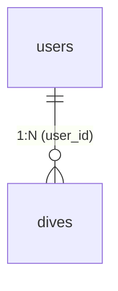

# `public.dives`

## メタ情報

| 項目 | 内容 |
|------|------|
| スキーマ | `public` |
| テーブル名 | `dives` |
| 説明 | ダイビングログ。PADI ログブックの標準項目を踏襲 |
| 主キー | `id` |
| RLS | 有効 |
| 関連機能 | [002 ダイブログ CRUD](../features/002-dive-log-crud/requirements.md) |
| ステータス | 確定 |

## 1. 概要

ユーザーが記録するダイビング 1 本ごとのログを保持するテーブル。1 ユーザーが多数のログを持つ 1:N 関係。PADI ログブックの項目を踏襲しており、必須項目（日付・場所・最大水深・潜水時間）以外は任意。

Phase 2 で「公開機能」を実装する予定があり、`is_public` / `public_slug` を先行で定義済み（Phase 1 では使用しない）。

## 2. カラム定義

### 基本情報

| カラム | 型 | NULL | デフォルト | 説明 |
|-------|----|------|----------|------|
| `id` | `uuid` | NO | `gen_random_uuid()` | 主キー |
| `user_id` | `uuid` | NO | — | 所有ユーザー。`users(id)` を参照 |
| `dive_number` | `integer` | YES | — | 通算ダイブ番号（任意管理） |
| `dive_date` | `date` | NO | — | 潜水日。1900-01-01〜当日 |
| `entry_time` | `time` | YES | — | エントリー時刻 |
| `exit_time` | `time` | YES | — | エキジット時刻 |

### ロケーション

| カラム | 型 | NULL | デフォルト | 説明 |
|-------|----|------|----------|------|
| `location` | `text` | NO | — | エリア / ポイント名 |
| `country` | `text` | YES | — | 国 |
| `dive_site` | `text` | YES | — | 詳細ポイント名 |
| `dive_type` | `text` | YES | — | ボート / ビーチ / ドリフト など |

### コンディション

| カラム | 型 | NULL | デフォルト | 説明 |
|-------|----|------|----------|------|
| `weather` | `text` | YES | — | 天気 |
| `air_temp_c` | `numeric(4, 1)` | YES | — | 気温（℃） |
| `water_temp_c` | `numeric(4, 1)` | YES | — | 水温（℃） |
| `visibility_m` | `numeric(4, 1)` | YES | — | 透明度（m） |
| `wave` | `text` | YES | — | 波・うねり |
| `current_condition` | `text` | YES | — | 流れの状況。予約語 `current` を避けて `current_condition` |

### 潜水データ

| カラム | 型 | NULL | デフォルト | 説明 |
|-------|----|------|----------|------|
| `max_depth_m` | `numeric(5, 2)` | NO | — | 最大水深（m）。0 < x ≦ 300 |
| `avg_depth_m` | `numeric(5, 2)` | YES | — | 平均水深（m） |
| `bottom_time_min` | `integer` | NO | — | 潜水時間（分）。≧ 1 |
| `surface_interval_min` | `integer` | YES | — | 水面休息時間（分） |

### 装備・ガス

| カラム | 型 | NULL | デフォルト | 説明 |
|-------|----|------|----------|------|
| `tank_type` | `text` | YES | — | スチール / アルミ など |
| `tank_volume_l` | `numeric(4, 1)` | YES | — | タンク容量（L） |
| `gas_type` | `text` | YES | — | Air / Nitrox など |
| `o2_percent` | `numeric(4, 1)` | YES | — | 酸素濃度（%、Nitrox 用） |
| `pressure_start_bar` | `integer` | YES | — | 開始残圧（bar） |
| `pressure_end_bar` | `integer` | YES | — | 終了残圧（bar） |
| `weight_kg` | `numeric(4, 1)` | YES | — | ウェイト（kg） |
| `suit_type` | `text` | YES | — | ウェット / ドライ / 厚さ |
| `equipment_notes` | `text` | YES | — | 装備メモ |

### メンバー・メモ

| カラム | 型 | NULL | デフォルト | 説明 |
|-------|----|------|----------|------|
| `buddy_name` | `text` | YES | — | バディ名 |
| `instructor_name` | `text` | YES | — | インストラクター名 |
| `certification_dive` | `boolean` | NO | `false` | 講習ダイブか |
| `notes` | `text` | YES | — | メモ・印象 |

### 公開（Phase 2 用）

| カラム | 型 | NULL | デフォルト | 説明 |
|-------|----|------|----------|------|
| `is_public` | `boolean` | NO | `false` | 公開フラグ |
| `public_slug` | `text` | YES | — | 公開 URL 用 slug（unique） |

### タイムスタンプ

| カラム | 型 | NULL | デフォルト | 説明 |
|-------|----|------|----------|------|
| `created_at` | `timestamptz` | NO | `now()` | 作成日時 |
| `updated_at` | `timestamptz` | NO | `now()` | 更新日時（トリガで自動更新） |

## 3. 制約

### 主キー

- `dives_pkey`: `(id)`

### 外部キー

| 制約名 | カラム | 参照先 | ON DELETE |
|--------|------|------|----------|
| `dives_user_id_fkey` | `user_id` | `public.users(id)` | `CASCADE` |

ユーザー削除時に紐づくダイブログもまとめて削除される。

### ユニーク制約

| 制約名 | カラム | 補足 |
|--------|------|------|
| `dives_public_slug_key` | `public_slug` | 公開 URL 用。`NULL` は重複可（PostgreSQL のユニーク制約仕様） |

### CHECK 制約

| 制約名 | 内容 |
|--------|------|
| `dives_dive_number_check` | `dive_number is null or dive_number >= 0` |
| `dives_dive_date_check` | `dive_date >= '1900-01-01' and dive_date <= current_date` |
| `dives_location_check` | `length(trim(location)) > 0` |
| `dives_visibility_m_check` | `visibility_m is null or visibility_m >= 0` |
| `dives_max_depth_m_check` | `max_depth_m > 0 and max_depth_m <= 300` |
| `dives_avg_depth_m_check` | `avg_depth_m is null or (avg_depth_m > 0 and avg_depth_m <= 300)` |
| `dives_bottom_time_min_check` | `bottom_time_min >= 1` |
| `dives_surface_interval_min_check` | `surface_interval_min is null or surface_interval_min >= 0` |
| `dives_tank_volume_l_check` | `tank_volume_l is null or tank_volume_l > 0` |
| `dives_o2_percent_check` | `o2_percent is null or (o2_percent >= 0 and o2_percent <= 100)` |
| `dives_pressure_start_bar_check` | `pressure_start_bar is null or pressure_start_bar >= 0` |
| `dives_pressure_end_bar_check` | `pressure_end_bar is null or pressure_end_bar >= 0` |
| `dives_weight_kg_check` | `weight_kg is null or weight_kg >= 0` |

## 4. インデックス

| インデックス名 | カラム | 種別 | 用途 |
|-------------|------|------|------|
| `idx_dives_user_id_dive_date` | `(user_id, dive_date desc)` | btree | 一覧表示（自分のログを日付降順） |
| `idx_dives_user_id_location` | `(user_id, location)` | btree | ポイント名検索 |
| `idx_dives_public_slug` | `(public_slug) where is_public = true` | 部分 btree | Phase 2 の公開 URL 解決 |

主キー `(id)` および `public_slug` のユニーク暗黙インデックスは別途存在。

## 5. RLS（Row Level Security）

RLS は **有効**。所有者のみ全 CRUD 可能。

| ポリシー名 | コマンド | 条件 |
|----------|---------|------|
| `users can read own dives` | `SELECT` | `(select auth.uid()) = user_id` |
| `users can insert own dives` | `INSERT` | `(select auth.uid()) = user_id`（`with check`） |
| `users can update own dives` | `UPDATE` | `(select auth.uid()) = user_id`（`using` / `with check` 両方） |
| `users can delete own dives` | `DELETE` | `(select auth.uid()) = user_id` |

- `auth.uid()` は `(select ...)` でラップし、行ごとに再評価されないようにしている（Supabase の `auth_rls_initplan` 警告対応）
- Phase 2 で公開機能を実装する際は、`is_public = true` の行に対する SELECT ポリシーを追加する想定

## 6. トリガー

| トリガー名 | タイミング | 関数 | 内容 |
|----------|----------|------|------|
| `dives_handle_updated_at` | `BEFORE UPDATE` | `public.handle_updated_at()` | `updated_at` を `now()` に更新 |

`handle_updated_at()` は `users` マイグレーションで定義された汎用関数を再利用。

## 7. ER（隣接テーブル）

## 8. 運用ノート

- ユーザー 1 人あたり数百〜数千行が想定上限。アクティブダイバーでも年間 100〜200 本程度
- 一覧表示は `idx_dives_user_id_dive_date` を使用したキーセットページネーション
- `user_id` は Server Action 側で `auth.uid()` から強制セット（クライアント送信値は無視）
- `is_public` / `public_slug` は Phase 1 では使用しないが、後から `ALTER TABLE` が不要なよう先行定義
- Phase 2 の公開機能では `public_slug` をクエリで引くため、`idx_dives_public_slug`（部分インデックス）で高速化

## 9. 関連リソース

- マイグレーション: `supabase/migrations/20260525130000_create_dives.sql`
- 型: `service-front/src/features/dives/types.ts`
- スキーマ: `service-front/src/features/dives/schemas/dive.schema.ts`
- 定数: `service-front/src/features/dives/constants.ts`（`dive_type` / `gas_type` 等の選択肢）
- 関連機能: [`specs/features/002-dive-log-crud/`](../features/002-dive-log-crud/)
- 関連画面: [`../screens/dive-list.md`](../screens/dive-list.md) / [`../screens/dive-detail.md`](../screens/dive-detail.md) / [`../screens/dive-new.md`](../screens/dive-new.md) / [`../screens/dive-edit.md`](../screens/dive-edit.md)
- 隣接テーブル: [`users.md`](users.md)

## 10. 変更履歴

| 日付 | マイグレーション | 変更内容 |
|------|---------------|---------|
| 2026-05-25 | `20260525130000_create_dives.sql` | 初版作成 |
