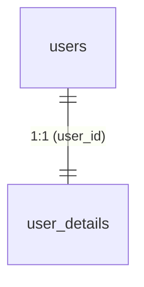

# `public.user_details`

## メタ情報

| 項目 | 内容 |
|------|------|
| スキーマ | `public` |
| テーブル名 | `user_details` |
| 説明 | ユーザーのプロフィール属性。`users` と 1:1 |
| 主キー | `user_id` |
| RLS | 有効 |
| 関連機能 | [001 認証](../features/001-auth/requirements.md) |
| ステータス | 確定 |

## 1. 概要

サインアップ時に収集する **姓名（漢字 / ローマ字）・ニックネーム・生年月日** を必須項目として保持し、性別・身長・体重を任意で保持するテーブル。`users` と 1:1 で紐づき、`user_id` を主キーかつ外部キーとして共有する。

`auth.users` への insert トリガー（`handle_new_user`）が `auth.signUp` の `options.data` を参照して自動挿入する。アプリケーションから直接 `insert` することはなく、`UPDATE` のみがユースケース。

## 2. カラム定義

| カラム | 型 | NULL | デフォルト | 説明 |
|-------|----|------|----------|------|
| `user_id` | `uuid` | NO | — | 主キー。`users(id)` を参照 |
| `last_name` | `text` | NO | — | 姓（漢字 / 表示用） |
| `first_name` | `text` | NO | — | 名（漢字 / 表示用） |
| `last_name_romaji` | `text` | NO | — | 姓（ローマ字） |
| `first_name_romaji` | `text` | NO | — | 名（ローマ字） |
| `nickname` | `text` | NO | — | ニックネーム（表示用） |
| `birth_on` | `date` | NO | — | 生年月日 |
| `gender` | `text` | NO | `'unanswered'` | 性別。`male` / `female` / `unanswered` |
| `height_cm` | `numeric(5, 2)` | YES | — | 身長（cm）。任意入力 |
| `weight_kg` | `numeric(5, 2)` | YES | — | 体重（kg）。任意入力 |
| `created_at` | `timestamptz` | NO | `now()` | 作成日時 |
| `updated_at` | `timestamptz` | NO | `now()` | 更新日時（トリガで自動更新） |

## 3. 制約

### 主キー

- `user_details_pkey`: `(user_id)`

### 外部キー

| 制約名 | カラム | 参照先 | ON DELETE |
|--------|------|------|----------|
| `user_details_user_id_fkey` | `user_id` | `public.users(id)` | `CASCADE` |

### ユニーク制約

`user_id` が主キーのため 1:1 が保証される。

### CHECK 制約

| 制約名 | 内容 | 補足 |
|--------|------|------|
| `user_details_last_name_check` | `length(trim(last_name)) > 0` | 空白のみ拒否 |
| `user_details_first_name_check` | `length(trim(first_name)) > 0` | 同上 |
| `user_details_last_name_romaji_check` | `length(trim(last_name_romaji)) > 0` | 同上 |
| `user_details_first_name_romaji_check` | `length(trim(first_name_romaji)) > 0` | 同上 |
| `user_details_nickname_check` | `length(trim(nickname)) > 0` | 同上 |
| `user_details_birth_on_check` | `birth_on >= '1900-01-01' and birth_on <= current_date` | 1900-01-01〜当日 |
| `user_details_gender_check` | `gender in ('male', 'female', 'unanswered')` | 3 値列挙 |
| `user_details_height_cm_check` | `height_cm > 0 and height_cm <= 300` | `NULL` は許容 |
| `user_details_weight_kg_check` | `weight_kg > 0 and weight_kg <= 500` | `NULL` は許容 |

## 4. インデックス

主キー `(user_id)` の暗黙インデックスのみ。

## 5. RLS（Row Level Security）

RLS は **有効**。

| ポリシー名 | コマンド | 条件 |
|----------|---------|------|
| `users can view own details` | `SELECT` | `(select auth.uid()) = user_id` |
| `users can update own details` | `UPDATE` | `(select auth.uid()) = user_id`（`with check` も同条件） |

- `INSERT` 用ポリシーは定義しない（`handle_new_user` が `SECURITY DEFINER` で RLS をバイパスして挿入する）
- `DELETE` 用ポリシーも定義しない（`users` のカスケード削除で自動削除）

## 6. トリガー

| トリガー名 | タイミング | 対象テーブル | 関数 | 内容 |
|----------|----------|------------|------|------|
| `user_details_handle_updated_at` | `BEFORE UPDATE` | `public.user_details` | `public.handle_updated_at()` | `updated_at` を `now()` に更新 |
| `on_auth_user_created` | `AFTER INSERT` | `auth.users` | `public.handle_new_user()` | `users` + `user_details` に挿入 |

`handle_new_user()` の実装で、`raw_user_meta_data` から以下の値を取り出して挿入する。

```sql
new.raw_user_meta_data->>'last_name'
new.raw_user_meta_data->>'first_name'
new.raw_user_meta_data->>'last_name_romaji'
new.raw_user_meta_data->>'first_name_romaji'
new.raw_user_meta_data->>'nickname'
(new.raw_user_meta_data->>'birth_on')::date
coalesce(new.raw_user_meta_data->>'gender', 'unanswered')
nullif(new.raw_user_meta_data->>'height_cm', '')::numeric
nullif(new.raw_user_meta_data->>'weight_kg', '')::numeric
```

`auth.signUp({ options: { data: { ... } } })` に渡す JSON のキーは上記と一致させる必要がある。

## 7. ER（隣接テーブル）



## 8. 運用ノート

- アプリケーションから直接 `insert` / `delete` しない（`auth.users` 経由）
- 姓名・ニックネーム・生年月日は変更可能だが、サインアップ後の変更フローは別途要件化が必要
- `gender` を将来拡張する場合は CHECK 制約とアプリ側 enum の両方を更新する
- `height_cm` / `weight_kg` は任意項目。プロダクト統計用途で参照することがあるため、空文字は保存せず `NULL` に正規化する（`nullif` 使用）

## 9. 関連リソース

- マイグレーション: `supabase/migrations/20260514120000_create_user_details.sql`
- 型: `service-front/src/features/auth/types.ts`
- スキーマ: `service-front/src/features/auth/schemas/signup.schema.ts`
- 関連機能: [`specs/features/001-auth/`](../features/001-auth/)
- 隣接テーブル: [`users.md`](users.md)

## 10. 変更履歴

| 日付 | マイグレーション | 変更内容 |
|------|---------------|---------|
| 2026-05-14 | `20260514120000_create_user_details.sql` | 初版作成。`handle_new_user` を再定義し `user_details` 同時挿入に対応 |
