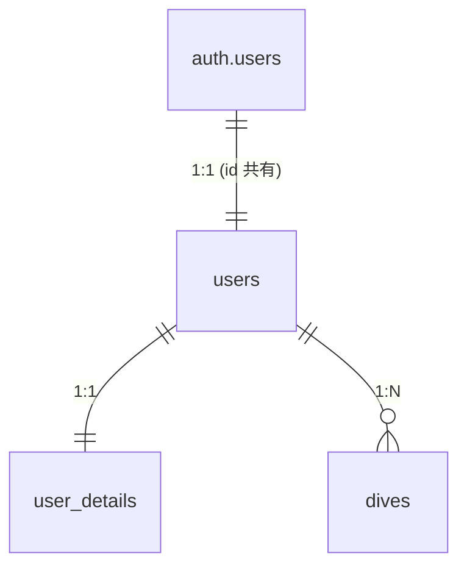

# `public.users`

## メタ情報

| 項目 | 内容 |
|------|------|
| スキーマ | `public` |
| テーブル名 | `users` |
| 説明 | アプリ側のユーザー識別子。`auth.users(id)` を主キーとして共有 |
| 主キー | `id` |
| RLS | 有効 |
| 関連機能 | [001 認証](../features/001-auth/requirements.md) |
| ステータス | 確定 |

## 1. 概要

`auth.users` と 1:1 で対応するアプリ側のユーザー識別子テーブル。プロフィール属性は `user_details`、ダイブログは `dives` など子テーブルに分離し、本テーブルは **「アプリ側の user として存在する」** ことだけを表す。

`auth.users` への `insert` トリガー（`handle_new_user`）で自動挿入されるため、アプリケーションコードから直接 `insert` することはない。

## 2. カラム定義

| カラム | 型 | NULL | デフォルト | 説明 |
|-------|----|------|----------|------|
| `id` | `uuid` | NO | — | 主キー。`auth.users(id)` を参照 |
| `created_at` | `timestamptz` | NO | `now()` | 作成日時 |
| `updated_at` | `timestamptz` | NO | `now()` | 更新日時（トリガで自動更新） |

## 3. 制約

### 主キー

- `users_pkey`: `(id)`

### 外部キー

| 制約名 | カラム | 参照先 | ON DELETE |
|--------|------|------|----------|
| `users_id_fkey` | `id` | `auth.users(id)` | `CASCADE` |

`auth.users` から削除されると同時にアプリ側からも削除される。

### ユニーク制約

`id` が主キーのためなし。

### CHECK 制約

なし。

## 4. インデックス

主キー `(id)` の暗黙インデックスのみ。

## 5. RLS（Row Level Security）

RLS は **有効**。

| ポリシー名 | コマンド | 条件 |
|----------|---------|------|
| `users can view own profile` | `SELECT` | `(select auth.uid()) = id` |
| `users can update own profile` | `UPDATE` | `(select auth.uid()) = id` |

- `INSERT` 用ポリシーは定義しない（`handle_new_user` が `SECURITY DEFINER` で RLS をバイパスして挿入する）
- `DELETE` 用ポリシーも定義しない（`auth.users` 削除に連動してカスケード削除されるため）

## 6. トリガー

| トリガー名 | タイミング | 対象テーブル | 関数 | 内容 |
|----------|----------|------------|------|------|
| `users_handle_updated_at` | `BEFORE UPDATE` | `public.users` | `public.handle_updated_at()` | `updated_at` を `now()` に更新 |
| `on_auth_user_created` | `AFTER INSERT` | `auth.users` | `public.handle_new_user()` | `public.users` と `public.user_details` に行を挿入 |

`handle_updated_at()` は本マイグレーションで定義した汎用関数で、他テーブルからも再利用される。

`handle_new_user()` は `user_details` 追加時に再定義されており、両テーブルへの挿入を行う（詳細は [`user_details.md`](user_details.md) 参照）。

## 7. ER（隣接テーブル）

## 8. 運用ノート

- アプリケーションから直接 `insert` / `delete` しない（`auth.users` 経由）
- `id` の値はクライアントから受け取らず、必ず `auth.uid()` を Server Action 側で使う
- 行数は登録ユーザー数と等しい

## 9. 関連リソース

- マイグレーション: `supabase/migrations/20260509100821_create_users.sql`
- 関連機能: [`specs/features/001-auth/`](../features/001-auth/)
- 隣接テーブル: [`user_details.md`](user_details.md) / [`dives.md`](dives.md)

## 10. 変更履歴

| 日付 | マイグレーション | 変更内容 |
|------|---------------|---------|
| 2026-05-09 | `20260509100821_create_users.sql` | 初版作成。`handle_updated_at` / `handle_new_user` トリガを定義 |
| 2026-05-14 | `20260514120000_create_user_details.sql` | `handle_new_user` を `user_details` 同時挿入に変更 |
