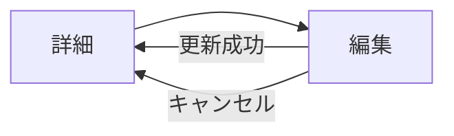

# ダイブログ編集

## メタ情報

| 項目 | 内容 |
|------|------|
| 画面ID | `dive-edit` |
| 関連機能 | [002 ダイブログ CRUD](../spec.md) |
| ルート | `/dives/[id]/edit` |
| 認証 | 必須 |
| 対応端末 | モバイル / タブレット / PC |
| ステータス | ドラフト |

## 1. 目的・概要

既存のダイブログを編集する。フォーム本体（`DiveForm`）は新規作成画面と共有し、初期値とサブミット先のみが異なる。所有者以外は RLS により 404。

## 2. 画面構成

### レイアウト

```
┌───────────────────────────────────────┐
│ Header                                  │
├───────────────────────────────────────┤
│ ← 詳細に戻る                           │
├───────────────────────────────────────┤
│ h1: ダイブログを編集                   │
├───────────────────────────────────────┤
│ ▼ 基本情報 / 潜水データ（常時展開）     │
│ ▼ コンディション / 装備 / メンバー / メモ│
│   （値があるセクションは初期展開）       │
├───────────────────────────────────────┤
│       [キャンセル]  [更新する]          │
└───────────────────────────────────────┘
```

### 画面要素

新規作成画面（[`dive-new.md`](dive-new.md)）と同一の `DiveForm` を使用するため、項目定義・バリデーションはそちらを参照。差分のみ以下に記載。

| ID | 要素 | 種別 | 表示内容 | 補足 |
|----|------|------|---------|------|
| E1 | 戻るリンク | リンク | `← 詳細に戻る` | `/dives/[id]` |
| E2 | ページタイトル | テキスト | `ダイブログを編集` | h1 |
| E3 | フォーム | `DiveForm` | 既存値を初期値として渡す | `defaultValues={dive}` |
| E4 | キャンセルボタン | リンクボタン | `キャンセル` | `/dives/[id]` |
| E5 | 更新ボタン | submit ボタン | `更新する` | 変更なしでも有効（バリデーション通過必須） |
| E6 | エラーサマリー | 領域 | バリデーション失敗時の集約 | `role="alert"` |

### 新規作成との差分

| 観点 | 新規作成 | 編集 |
|------|---------|------|
| 初期値 | 空 | 既存 dive の値 |
| Server Action | `createDive(values)` | `updateDive(id, values)` |
| 成功時遷移 | `/dives/[新規 id]` | `/dives/[id]`（同じ詳細画面） |
| キャンセル戻り先 | `/dives` | `/dives/[id]` |
| 保存ボタン文言 | `保存する` | `更新する` |
| セクション初期展開 | 必須セクションのみ | 値があるセクションは展開 |

## 3. 状態（State）

| 状態 | 条件 | 表示 |
|------|------|------|
| 初期表示 | 自分のログ | フォーム（既存値プリセット） |
| 404 | 他人のログ / 存在しない id | Next.js の `notFound()` で 404 |
| ローディング | 初期データ取得中 | スケルトン UI（Server Component で取得済みなら不要） |
| バリデーションエラー | 送信時に必須欠落・型違反 | E6 サマリー + 各フィールドにメッセージ |
| 送信中 | E5 押下後 | フォーム全体 `disabled`、E5 にスピナー |
| 送信成功 | Server Action 成功 | `/dives/[id]` へリダイレクト + 更新完了トースト |
| 送信エラー | Server Action 失敗 | E6 にサーバーエラーを表示、入力は維持 |
| 楽観ロック衝突 | 取得時の `updated_at` と現行が不一致 | 警告ダイアログ「他で変更されています。再読み込みしてください」（任意・Phase 2 検討） |

## 4. 操作・遷移

| 操作 | トリガー | 遷移先・挙動 |
|------|---------|-------------|
| 戻る / キャンセル | E1 / E4 クリック | 変更なしで即 `/dives/[id]`、変更ありは離脱確認ダイアログ |
| セクション展開 | セクション見出しクリック | `aria-expanded` をトグル |
| 更新 | E5 クリック / Enter | Server Action `updateDive(id, values)` 実行 |

### 画面遷移図



## 5. バリデーション・エラーメッセージ

[`dive-new.md` の「5. バリデーション・エラーメッセージ」](dive-new.md#5-バリデーションエラーメッセージ) を参照。差分なし。

ただしサーバーエラー時の文言は更新文脈に合わせる:
- 5xx・ネットワーク: `更新に失敗しました。しばらく経ってからもう一度お試しください`

## 6. アクセシビリティ要件

[`dive-new.md` の「6. アクセシビリティ要件」](dive-new.md#6-アクセシビリティ要件) を参照。差分なし。

画面到達時のフォーカスは h1 もしくは最初の入力フィールドに当てる。

## 7. レスポンシブ

[`dive-new.md` の「7. レスポンシブ」](dive-new.md#7-レスポンシブ) を参照。差分なし。

## 8. 表示条件・権限

- 認証済みユーザーのみアクセス可能
- 自分のログのみ編集可能（RLS で保証、他人の id は 404）
- 更新時の `user_id` 変更は Server Action 側で禁止（クライアント送信値は無視）

## 9. 関連リソース

- 機能仕様: [`../spec.md`](../spec.md)
- 実装計画: [`../plan.md`](../plan.md)
- テーブル定義: [`../data-model.md`](../data-model.md)
- 実装: `service-front/src/app/(authenticated)/dives/[id]/edit/page.tsx` / `service-front/src/features/dives/components/client/DiveForm/DiveForm.tsx`
- 関連画面: [`dive-detail.md`](dive-detail.md) / [`dive-new.md`](dive-new.md)
- 移行元: `docs/specs/screens/dive-edit.md`

## 10. 変更履歴

| 日付 | 変更内容 | 担当 |
|------|---------|------|
| 2026-05-27 | 初版作成 | - |
| 2026-06-10 | spec-kit 形式（`specs/002-dive-log-crud/screens/`）へ移行 | - |
